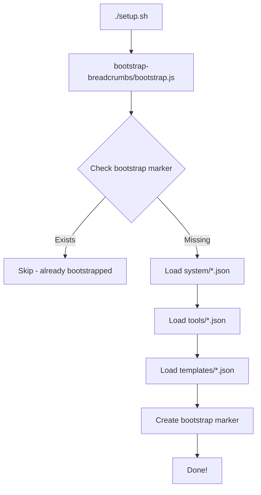

# Bootstrap: Single Source of Truth

## ✅ Problem Solved

RCRT now has a **single, clear source of truth** for all bootstrap data.

## The Solution

### `bootstrap-breadcrumbs/` - The ONLY Source

```
bootstrap-breadcrumbs/
├── system/                    # Agents and system configs
│   ├── default-chat-agent.json ← THE ONLY agent definition
│   └── bootstrap-marker.json
├── tools/                     # Tool definitions
│   ├── openrouter.json
│   ├── calculator.json
│   ├── random.json
│   └── context-builder.json
├── templates/                 # User templates
│   ├── agent-definition-template.json
│   └── tool-definition-template.json
└── bootstrap.js               # THE ONLY bootstrap script
```

### Strict Rules

❌ **DELETED:**
- `scripts/default-chat-agent.json` - Duplicate
- `scripts/default-chat-agent-v2.json` - Duplicate
- `bootstrap-breadcrumbs/system/default-chat-agent-v3.json` - Duplicate
- `rcrt-visual-builder/apps/agent-runner/ensure-default-agent.js` - Hardcoded fallback
- `rcrt-visual-builder/apps/agent-runner/ensure-default-agent-simple.js` - Duplicate
- `scripts/load-default-agent.js` - Duplicate

❌ **NO LONGER ALLOWED:**
- Hardcoded agent definitions in code
- Fallback definitions "just in case"
- Multiple versions of same agent
- Tool definitions only in code

✅ **REQUIRED:**
- All bootstrap data in `bootstrap-breadcrumbs/`
- Single version per component
- JSON files only, no code
- Clear error messages if files missing

## How It Works Now

### Bootstrap Flow



### File Loading (No Fallbacks!)

```javascript
// ✅ CORRECT - Fail fast if file missing
const agentPath = 'bootstrap-breadcrumbs/system/default-chat-agent.json';
const agentData = JSON.parse(fs.readFileSync(agentPath, 'utf-8'));

// ❌ WRONG - Don't do this!
const agentData = loadFromFile() || HARDCODED_FALLBACK;
```

## Benefits

✅ **Clarity**: Anyone can see exactly what's bootstrapped  
✅ **Version Control**: Git tracks changes to agent definitions  
✅ **Portability**: Fork and customize JSON files  
✅ **No Surprises**: System fails fast if bootstrap files missing  
✅ **Easy Updates**: Edit JSON, run bootstrap.js, done  
✅ **Testability**: Clear inputs/outputs  
✅ **Documentation**: Files self-document the system  

## Usage

### First-Time Setup
```bash
./setup.sh
# Automatically runs: cd bootstrap-breadcrumbs && node bootstrap.js
```

### After Modifying Bootstrap Data
```bash
# 1. Edit JSON file
vim bootstrap-breadcrumbs/system/default-chat-agent.json

# 2. Re-bootstrap
cd bootstrap-breadcrumbs
node bootstrap.js

# 3. Restart services if needed
docker compose restart agent-runner
```

### Adding New Components

**New Agent:**
```bash
# 1. Create JSON file
cat > bootstrap-breadcrumbs/system/my-agent.json << 'EOF'
{
  "schema_name": "agent.def.v1",
  "title": "My Custom Agent",
  "tags": ["agent:def", "workspace:agents", "system:bootstrap"],
  "context": {
    "agent_id": "my-custom-agent",
    "model": "openrouter/anthropic/claude-3.5-sonnet",
    "system_prompt": "You are...",
    "capabilities": {...},
    "subscriptions": {...}
  }
}
EOF

# 2. Run bootstrap
cd bootstrap-breadcrumbs && node bootstrap.js
```

**New Tool:**
```bash
# 1. Create JSON file
cat > bootstrap-breadcrumbs/tools/my-tool.json << 'EOF'
{
  "schema_name": "tool.v1",
  "title": "My Custom Tool",
  "tags": ["tool", "tool:my-tool", "workspace:tools"],
  "context": {
    "name": "my-tool",
    "description": "...",
    "implementation": {
      "type": "builtin",
      "module": "@rcrt-builder/tools",
      "export": "builtinTools.mytool"
    },
    "definition": {
      "inputSchema": {...},
      "outputSchema": {...}
    }
  }
}
EOF

# 2. Run bootstrap
cd bootstrap-breadcrumbs && node bootstrap.js
```

## Verification

### Check What's Bootstrapped
```bash
# View all system breadcrumbs
curl -H "Authorization: Bearer $TOKEN" \
  "http://localhost:8081/breadcrumbs?tag=system:bootstrap"

# View default agent
curl -H "Authorization: Bearer $TOKEN" \
  "http://localhost:8081/breadcrumbs?schema_name=agent.def.v1&tag=workspace:agents"

# View tools
curl -H "Authorization: Bearer $TOKEN" \
  "http://localhost:8081/breadcrumbs?schema_name=tool.v1&tag=workspace:tools"
```

### Check Bootstrap Status
```bash
# View bootstrap marker
curl -H "Authorization: Bearer $TOKEN" \
  "http://localhost:8081/breadcrumbs?schema_name=system.bootstrap.v1"
```

## Troubleshooting

### "Agent definition not found"

**Problem**: Script can't find `bootstrap-breadcrumbs/system/default-chat-agent.json`

**Solution**:
```bash
# Verify file exists
ls -la bootstrap-breadcrumbs/system/default-chat-agent.json

# If missing, restore from git
git checkout bootstrap-breadcrumbs/system/default-chat-agent.json
```

### "Tool not available"

**Problem**: Tool not showing up in catalog

**Solution**:
```bash
# 1. Check if tool JSON exists
ls -la bootstrap-breadcrumbs/tools/

# 2. Re-run bootstrap
cd bootstrap-breadcrumbs && node bootstrap.js

# 3. Restart tools-runner
docker compose restart tools-runner
```

### Multiple Agents Loaded

**Problem**: Different agent versions appearing

**Solution**:
```bash
# 1. Clean database
docker compose down -v

# 2. Verify ONLY ONE agent definition exists
ls -la bootstrap-breadcrumbs/system/*.json | grep agent

# 3. Re-setup
./setup.sh
```

## Migration from Old System

If you have custom agents/tools:

### 1. Export Current Agents
```bash
# Get all agents
curl -H "Authorization: Bearer $TOKEN" \
  "http://localhost:8081/breadcrumbs?schema_name=agent.def.v1" \
  > current-agents.json

# Extract each agent to separate file
# (manual step - copy each agent's context to bootstrap-breadcrumbs/system/)
```

### 2. Clean Database
```bash
docker compose down -v
```

### 3. Re-bootstrap
```bash
./setup.sh
```

## Code Changes Summary

### Updated Files
- ✅ `bootstrap-breadcrumbs/bootstrap.js` - Now loads tools from JSON
- ✅ `bootstrap-breadcrumbs/README.md` - Documents new structure
- ✅ `bootstrap-breadcrumbs/system/default-chat-agent.json` - Single source
- ✅ `ensure-default-agent.js` - Removed hardcoded fallback
- ✅ `setup.sh` - Uses bootstrap.js instead of individual scripts

### Deleted Files
- ✅ `scripts/default-chat-agent.json`
- ✅ `scripts/default-chat-agent-v2.json`
- ✅ `bootstrap-breadcrumbs/system/default-chat-agent-v3.json`
- ✅ `rcrt-visual-builder/apps/agent-runner/ensure-default-agent.js`
- ✅ `rcrt-visual-builder/apps/agent-runner/ensure-default-agent-simple.js`
- ✅ `scripts/load-default-agent.js`

### New Files
- ✅ `bootstrap-breadcrumbs/tools/openrouter.json`
- ✅ `bootstrap-breadcrumbs/tools/calculator.json`
- ✅ `bootstrap-breadcrumbs/tools/random.json`
- ✅ `bootstrap-breadcrumbs/tools/context-builder.json`

## Best Practices

### 1. Single Version

```bash
# ✅ Good - One file per component
bootstrap-breadcrumbs/system/default-chat-agent.json

# ❌ Bad - Multiple versions
bootstrap-breadcrumbs/system/default-chat-agent-v2.json
bootstrap-breadcrumbs/system/default-chat-agent-v3.json
```

### 2. Clear Naming

```bash
# ✅ Good - Descriptive names
bootstrap-breadcrumbs/tools/openrouter.json
bootstrap-breadcrumbs/tools/context-builder.json

# ❌ Bad - Vague names
bootstrap-breadcrumbs/tools/tool1.json
bootstrap-breadcrumbs/tools/temp.json
```

### 3. Complete Metadata

```json
{
  "context": {
    "name": "my-tool",
    "version": "1.0.0",
    "metadata": {
      "author": "system",
      "created": "2024-01-01T00:00:00Z",
      "source_of_truth": "bootstrap-breadcrumbs/tools/my-tool.json"
    }
  }
}
```

### 4. No Code Fallbacks

```typescript
// ❌ BAD - Hardcoded fallback
const agentDef = loadFromFile() || {
  schema_name: 'agent.def.v1',
  // ... hardcoded definition
};

// ✅ GOOD - Fail fast
const agentDef = loadFromFile();
if (!agentDef) {
  throw new Error('Agent definition not found. Run bootstrap first.');
}
```

## Future: Tool Code Generation

Eventually, tool implementations can be generated from JSON:

```json
{
  "implementation": {
    "type": "wasm",
    "module": "tools/my-tool.wasm"
  }
}
```

But for now, tools are implemented in TypeScript/JavaScript and referenced via `builtinTools`.

---

**Status**: ✅ Implemented  
**Version**: 2.0  
**Related**: bootstrap-breadcrumbs/README.md, BOOTSTRAP_CONSOLIDATION_PLAN.md
