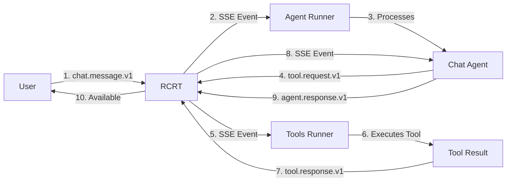

# Chat Agent Bootstrap Requirements

## Core Components Needed

### 1. **Services Running** 🏃
```yaml
Required:
- db (PostgreSQL)
- nats (Messaging)
- rcrt (API Server with transforms)
- agent-runner (Executes agents)
- tools-runner (Executes tools)

Optional:
- dashboard (Visual management)
- builder (Visual builder UI)
```

### 2. **Breadcrumbs** 📋

#### a) Agent Definition
```json
{
  "schema_name": "agent.def.v1",
  "title": "Default Chat Assistant",
  "context": {
    "agent_id": "default-chat-assistant",
    "model": "openrouter/google/gemini-2.0-flash-exp:free",
    "subscriptions": {
      "selectors": [
        // Listen for chat messages
        { "schema_name": "chat.message.v1" },
        // Discover tools
        { "schema_name": "tool.catalog.v1" },
        // Receive tool responses
        { "schema_name": "tool.response.v1" }
      ]
    }
  }
}
```

#### b) Tool Catalog
```json
{
  "schema_name": "tool.catalog.v1",
  "context": {
    "tools": [...],
    "llm_hints": {
      "transform": {
        "tool_summary": { /* Makes it LLM-friendly */ }
      }
    }
  }
}
```

### 3. **Environment Variables** 🔐
```bash
# Required for tools
OPENROUTER_API_KEY=sk-or-v1-xxx  # For OpenRouter tool
SERPAPI_API_KEY=xxx               # For search tool (optional)

# System defaults (usually OK)
RCRT_BASE_URL=http://localhost:8081
OWNER_ID=00000000-0000-0000-0000-000000000001
AGENT_ID=00000000-0000-0000-0000-000000000AAA
```

### 4. **Message Flow** 🔄



## Bootstrap Process

### Step 1: Environment Setup
```bash
# Create/update .env file
cat > .env << 'EOF'
RCRT_BASE_URL=http://localhost:8081
OWNER_ID=00000000-0000-0000-0000-000000000001
AGENT_ID=00000000-0000-0000-0000-000000000AAA
OPENROUTER_API_KEY=your-key-here
OPENROUTER_REFERER=http://localhost:8082
EOF
```

### Step 2: Start Services
```bash
# Core services first
docker compose up -d db nats rcrt

# Wait for health
sleep 10

# Agent and tools runners
docker compose up -d agent-runner tools-runner

# Optional UI
docker compose up -d dashboard
```

### Step 3: Run Bootstrap
```bash
cd bootstrap-breadcrumbs
npm install
node bootstrap.js
```

### Step 4: Verify Setup
```bash
# Test the flow
node test-chat-agent-flow.js

# Or send a message
node send-chat-message.js "Hello, what can you do?"
```

## What Happens When It Works

1. **User sends message** → Creates `chat.message.v1` breadcrumb
2. **Agent receives** → Via SSE subscription
3. **Agent processes** → Uses LLM to understand intent
4. **Agent discovers tools** → From `tool.catalog.v1` (with transforms!)
5. **Agent invokes tool** → Creates `tool.request.v1`
6. **Tool executes** → Tools-runner processes request
7. **Tool responds** → Creates `tool.response.v1`
8. **Agent gets result** → Via SSE subscription
9. **Agent responds** → Creates `agent.response.v1`
10. **User sees response** → In dashboard or via API

## Common Issues & Solutions

### ❌ "No agent response"
- Check: `docker compose logs agent-runner`
- Fix: Ensure agent-runner is healthy

### ❌ "Tool not found"
- Check: `docker compose logs tools-runner`
- Fix: Ensure tools-runner published catalog

### ❌ "No OpenRouter API key"
- Check: `.env` file has `OPENROUTER_API_KEY`
- Fix: Add key and restart tools-runner

### ❌ "Transform not working"
- Check: RCRT server logs
- Fix: Rebuild RCRT with transform support

## Quick Test Commands

```bash
# Send a simple message
node send-chat-message.js "What's 2+2?"

# Ask about tools
node send-chat-message.js "What tools do you have?"

# Request tool usage
node send-chat-message.js "Search the web for RCRT documentation"

# File storage test
node send-chat-message.js "Store a file called test.txt with content: Hello World"
```

## Success Indicators ✅

1. Tool catalog has `llm_hints` and transforms work
2. Agent receives transformed tool catalog (concise view)
3. Agent can create `tool.request.v1` breadcrumbs
4. Tools execute and return `tool.response.v1`
5. Agent incorporates tool results in final response

The bootstrap system sets all this up automatically!
