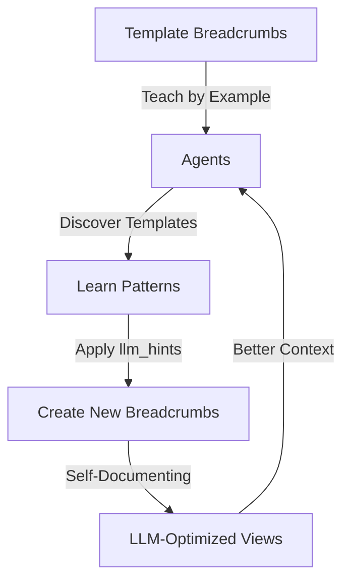

# RCRT Template & LLM Hints System Overview

## 🎯 The Vision: Self-Teaching Data

With inline `llm_hints` and template breadcrumbs, RCRT becomes self-documenting and self-improving.

## 🔄 How It Works



## 📚 Template Library Created

### 1. **LLM Hints Usage Guide** (`guide.template.v1`)
Shows how to use `llm_hints` with examples:
- Basic transforms (template, extract, jq)
- Field selection (include/exclude)
- Transform modes (replace/merge)

### 2. **Tool Catalog Template** (`template.v1`)
Template for creating tool catalogs with proper transforms:
```json
{
  "llm_hints": {
    "transform": {
      "tool_summary": {
        "type": "template",
        "template": "{{context.activeTools}} tools: ..."
      }
    },
    "mode": "replace"
  }
}
```

### 3. **Agent Definition Template** (`template.v1`)
Shows agents how to:
- Subscribe to tool catalogs
- Subscribe to templates
- Use context from breadcrumbs
- Create proper responses

### 4. **Transform Patterns Library** (`guide.pattern.v1`)
Common patterns:
- Array summarization
- Sensitive data redaction
- Status aggregation
- Nested to flat transforms
- Conditional transforms

### 5. **Agent Learning Guide** (`guide.integration.v1`)
How agents discover and learn:
1. Subscribe to templates
2. Analyze structure
3. Apply patterns
4. Create better breadcrumbs

### 6. **Template Creation Guide** (`guide.meta.v1`)
Meta-guide showing how to create templates

### 7. **Context View API Guide** (`guide.api.v1`)
How to use `/breadcrumbs/{id}` for LLM-optimized views

## 🚀 Benefits Realized

1. **Immediate Value** - Works today with client-side transforms
2. **Self-Improving** - Templates teach best practices
3. **Token Efficient** - LLMs see only what they need
4. **Discoverable** - Agents find patterns automatically
5. **Flexible** - Each breadcrumb controls its view

## 💡 Example: Tool Catalog Evolution

### Before (Raw Data):
```json
{
  "tools": [
    {
      "name": "openrouter",
      "description": "Access to 100+ LLM models",
      "inputSchema": { /* 50+ lines */ },
      "outputSchema": { /* 30+ lines */ },
      "capabilities": { /* details */ }
    }
    // ... 10 more tools
  ]
}
```

### After (With llm_hints):
```json
{
  "tool_summary": "10 tools: openrouter (llm), file-storage (storage), calculator (math)...",
  "usage": "Create tool.request.v1 breadcrumb to invoke"
}
```

## 🔮 Next Steps

1. **Today**: Templates guide usage of `llm_hints`
2. **Next**: Server honors `llm_hints` automatically
3. **Future**: UI for managing transforms
4. **Vision**: All data self-describes for optimal LLM consumption

The beauty is that the system teaches itself through templates!
