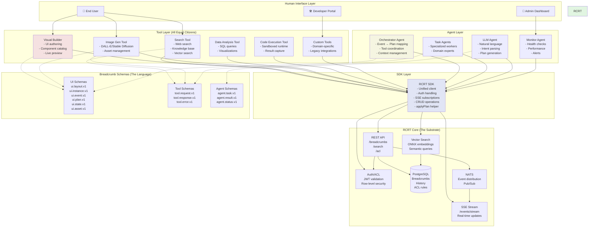
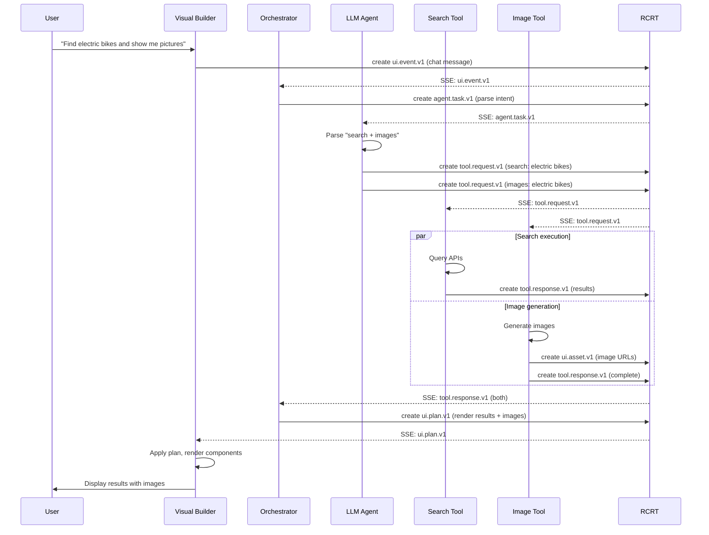

# RCRT Full Agentic System Architecture

This document illustrates how RCRT serves as the foundation for a complete agentic system where multiple tools, agents, and UI components interact through a unified interface.

## System Overview



## How Tools Interact (All Are Equal)

### 1. Visual Builder (A UI Tool)
```typescript
// Just another RCRT client that happens to render UI
const client = createClient({ baseUrl: '/api/rcrt' });

// Listen for events
client.startEventStream((evt) => {
  if (evt.schema_name === 'ui.event.v1') {
    // React to user interactions
  }
});

// Apply UI changes
await client.applyPlan({
  schema_name: 'ui.plan.v1',
  context: { actions: [...] }
});
```

### 2. Search Tool (A Compute Tool)
```typescript
// Exact same pattern
const client = createClient({ baseUrl: '/api/rcrt' });

// Listen for search requests
client.startEventStream((evt) => {
  if (evt.schema_name === 'tool.request.v1' && evt.context.tool === 'search') {
    const results = await performSearch(evt.context.query);
    
    // Write results as breadcrumbs
    await client.createBreadcrumb({
      schema_name: 'tool.response.v1',
      context: { tool: 'search', results }
    });
    
    // Optionally update UI
    await client.applyPlan({
      schema_name: 'ui.plan.v1',
      context: {
        actions: [{
          type: 'create_instance',
          instance: { 
            component_ref: 'SearchResults',
            props: { data: results }
          }
        }]
      }
    });
  }
});
```

### 3. Image Generation Tool
```typescript
// Still the same pattern
const client = createClient({ baseUrl: '/api/rcrt' });

client.startEventStream(async (evt) => {
  if (evt.schema_name === 'tool.request.v1' && evt.context.tool === 'image_gen') {
    const imageUrl = await generateImage(evt.context.prompt);
    
    // Store as asset
    const asset = await client.createBreadcrumb({
      schema_name: 'ui.asset.v1',
      context: { type: 'image', url: imageUrl, metadata: { prompt: evt.context.prompt } }
    });
    
    // Update UI to show image
    await client.applyPlan({
      schema_name: 'ui.plan.v1',
      context: {
        actions: [{
          type: 'create_instance',
          instance: {
            component_ref: 'Image',
            props: { src_tag: asset.id }
          }
        }]
      }
    });
  }
});
```

## Agent Architecture

### Orchestrator Agent (Traffic Controller)
```typescript
// The orchestrator coordinates between tools
const client = createClient({ baseUrl: '/api/rcrt' });

client.startEventStream(async (evt) => {
  if (evt.schema_name === 'ui.event.v1') {
    const { event_name, context } = evt.context;
    
    // Decide what to do based on event
    if (event_name === 'onSearch') {
      // Dispatch to search tool
      await client.createBreadcrumb({
        schema_name: 'tool.request.v1',
        context: { tool: 'search', query: context.query }
      });
    } else if (event_name === 'onGenerateImage') {
      // Dispatch to image tool
      await client.createBreadcrumb({
        schema_name: 'tool.request.v1',
        context: { tool: 'image_gen', prompt: context.prompt }
      });
    }
  }
  
  // Coordinate tool responses
  if (evt.schema_name === 'tool.response.v1') {
    // Update UI based on tool results
    const plan = buildUIUpdatePlan(evt);
    await client.applyPlan(plan);
  }
});
```

### LLM Agent (Natural Language Understanding)
```typescript
// LLM agent interprets natural language and generates plans
const client = createClient({ baseUrl: '/api/rcrt' });

client.startEventStream(async (evt) => {
  if (evt.schema_name === 'ui.event.v1' && evt.context.event_name === 'onChat') {
    const userMessage = evt.context.message;
    
    // Use LLM to understand intent
    const intent = await llm.parseIntent(userMessage);
    
    // Generate appropriate plan
    if (intent.type === 'search') {
      await client.createBreadcrumb({
        schema_name: 'tool.request.v1',
        context: { tool: 'search', query: intent.query }
      });
    } else if (intent.type === 'ui_modification') {
      const plan = await llm.generateUIPlan(intent);
      await client.applyPlan(plan);
    }
  }
});
```

## Key Design Principles

### 1. **Everything is a Breadcrumb Client**
- Visual Builder, Search Tool, Image Gen - all are peers
- They all read/write breadcrumbs and listen to SSE
- No tool has special privileges in the architecture

### 2. **Uniform Interface via SDK**
```typescript
// Every tool/agent uses the same SDK methods:
client.createBreadcrumb()     // Write data
client.searchBreadcrumbs()    // Query data
client.startEventStream()     // Subscribe to changes
client.applyPlan()           // Make UI changes
```

### 3. **Schema-Based Communication**
- Tools don't talk directly to each other
- They communicate via breadcrumb schemas
- RCRT is the event bus and source of truth

### 4. **Composable and Extensible**
- Add new tools by implementing the same interface
- Add new schemas for new capabilities
- Mix and match tools based on needs

## Real-World Example Flow



## Why This Architecture Works

### 1. **Decoupled**
- Tools don't know about each other
- Can develop and deploy independently
- Easy to test in isolation

### 2. **Scalable**
- Add more tools without changing existing ones
- Horizontal scaling of individual tools
- RCRT handles coordination

### 3. **Debuggable**
- All communication is visible as breadcrumbs
- Full audit trail in PostgreSQL
- Can replay events for debugging

### 4. **Flexible**
- Tools can be serverless functions, containers, or processes
- Can be written in any language with HTTP client
- Can run anywhere with network access to RCRT

## Getting Started

### To Build a New Tool

1. **Use the SDK**
```typescript
import { createClient } from '@rcrt-builder/sdk';
const client = await createClient({ 
  baseUrl: 'https://your-rcrt.com/api',
  tokenEndpoint: '/auth/token' 
});
```

2. **Subscribe to Events**
```typescript
client.startEventStream((evt) => {
  if (evt.schema_name === 'tool.request.v1' && evt.context.tool === 'your_tool') {
    // Handle request
  }
});
```

3. **Write Results**
```typescript
await client.createBreadcrumb({
  schema_name: 'tool.response.v1',
  context: { tool: 'your_tool', result: data }
});
```

4. **Update UI (Optional)**
```typescript
await client.applyPlan({
  schema_name: 'ui.plan.v1',
  context: { actions: [...] }
});
```

That's it! Your tool is now part of the agentic system.

## Summary

RCRT provides the substrate (storage, events, auth, search) while tools and agents are equal citizens that:
- Read and write breadcrumbs
- Subscribe to real-time events
- Optionally update UI via plans

The Visual Builder is just one tool among many - special only in that it renders UI for humans. From RCRT's perspective, all tools are the same: authenticated clients that speak breadcrumbs.
