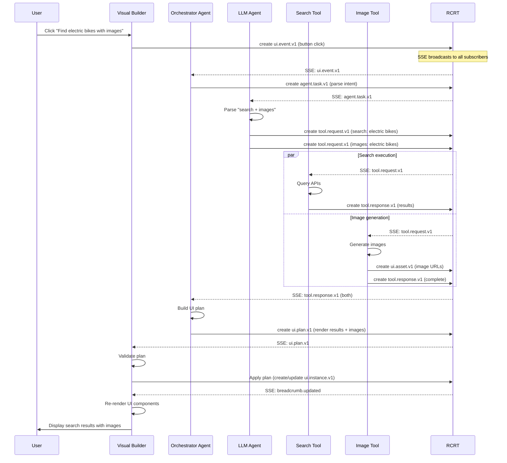

# RCRT Full Agentic Ecosystem Architecture

This diagram shows how the Visual Builder fits into the complete RCRT agentic system, where all tools and agents are equal citizens communicating through breadcrumbs.

## Complete System Architecture

```mermaid
graph TB
    subgraph "Human Interface Layer"
        User[👤 End User]
        DevPortal[🛠️ Developer Portal]
        Admin[👔 Admin Dashboard]
    end

    subgraph "Tool Layer (All Equal Citizens)"
        VB[🎨 Visual Builder<br/>- UI authoring<br/>- Component catalog<br/>- Live preview<br/>- Plan validation/apply]
        Search[🔍 Search Tool<br/>- Web search<br/>- Knowledge base<br/>- Vector search]
        ImgGen[🖼️ Image Gen Tool<br/>- DALL-E/Stable Diffusion<br/>- Asset management]
        DataTool[📊 Data Analysis Tool<br/>- SQL queries<br/>- Visualizations]
        CodeTool[⚙️ Code Execution Tool<br/>- Sandboxed runtime<br/>- Result capture]
        CustomTool[🔧 Custom Tools<br/>- Domain-specific<br/>- Legacy integrations]
    end

    subgraph "Agent Layer"
        Orchestrator[🎭 Orchestrator Agent<br/>- Event → Plan mapping<br/>- Tool coordination<br/>- Context management]
        TaskAgent[🤖 Task Agents<br/>- Specialized workers<br/>- Domain experts]
        LLMAgent[🧠 LLM Agent<br/>- Natural language<br/>- Intent parsing<br/>- Plan generation]
        MonitorAgent[📈 Monitor Agent<br/>- Health checks<br/>- Performance<br/>- Alerts]
    end

    subgraph "SDK Layer"
        SDK[📦 RCRT SDK<br/>- createClient()<br/>- Auth handling<br/>- SSE subscriptions<br/>- CRUD operations<br/>- applyPlan() helper<br/>- setToken() management]
    end

    subgraph "RCRT Core (The Substrate)"
        API[🌐 REST API<br/>/breadcrumbs<br/>/search<br/>/acl<br/>/agents<br/>/secrets]
        SSE[📡 SSE Stream<br/>/events/stream<br/>Real-time updates<br/>access_token support]
        Auth[🔐 Auth/ACL<br/>JWT validation<br/>Row-level security<br/>Per-breadcrumb ACLs]
        VecSearch[🔎 Vector Search<br/>ONNX embeddings<br/>Semantic queries<br/>MiniLM L6 v2]
        DB[(🗄️ PostgreSQL<br/>Breadcrumbs<br/>History<br/>ACL rules<br/>pgvector)]
        EventBus[📨 NATS<br/>Event distribution<br/>Pub/Sub<br/>Webhooks<br/>DLQ]
    end

    subgraph "Breadcrumb Schemas (The Language)"
        UISchemas[🎨 UI Schemas<br/>ui.layout.v1<br/>ui.instance.v1<br/>ui.event.v1<br/>ui.plan.v1<br/>ui.state.v1<br/>ui.asset.v1<br/>ui.template.v1<br/>ui.component.v1<br/>ui.validation.v1<br/>ui.plan.result.v1<br/>ui.composite.v1<br/>ui.theme.v1<br/>ui.styles.v1]
        ToolSchemas[🔧 Tool Schemas<br/>tool.request.v1<br/>tool.response.v1<br/>tool.error.v1]
        AgentSchemas[🤖 Agent Schemas<br/>agent.task.v1<br/>agent.result.v1<br/>agent.status.v1<br/>agent.def.v1<br/>flow.definition.v1]
    end

    subgraph "Visual Builder Specifics"
        UILoader[🎭 UILoader<br/>- Renders from breadcrumbs<br/>- SSE live updates<br/>- Pointer resolution]
        ComponentRegistry[📚 Component Registry<br/>- HeroUI components<br/>- Custom components<br/>- Prop validation]
        ForgeAPI[⚙️ Forge API<br/>- Plan validation<br/>- Plan application<br/>- Auth forwarding]
        AuthAPI[🔑 Auth API<br/>- JWT generation<br/>- Dev token minting]
    end

    %% User interactions
    User --> VB
    User --> Search
    User --> ImgGen
    DevPortal --> CustomTool
    Admin --> MonitorAgent

    %% All tools use SDK equally
    VB --> SDK
    Search --> SDK
    ImgGen --> SDK
    DataTool --> SDK
    CodeTool --> SDK
    CustomTool --> SDK

    %% All agents use SDK equally
    Orchestrator --> SDK
    TaskAgent --> SDK
    LLMAgent --> SDK
    MonitorAgent --> SDK

    %% SDK talks to RCRT
    SDK --> API
    SDK --> SSE
    SDK --> Auth
    SDK --> VecSearch

    %% Visual Builder internals
    VB --> UILoader
    VB --> ComponentRegistry
    VB --> ForgeAPI
    VB --> AuthAPI
    ForgeAPI --> SDK
    AuthAPI --> SDK

    %% RCRT internals
    API --> DB
    API --> EventBus
    EventBus --> SSE
    API --> Auth
    VecSearch --> DB

    %% Schema usage (dotted lines)
    VB -.-> UISchemas
    Search -.-> ToolSchemas
    ImgGen -.-> ToolSchemas
    ImgGen -.-> UISchemas
    Orchestrator -.-> UISchemas
    LLMAgent -.-> AgentSchemas
    TaskAgent -.-> ToolSchemas

    %% Styling
    classDef rcrtCore fill:#e1f5e1
    classDef sdkLayer fill:#e1e5f5
    classDef visualBuilder fill:#f5e1e1
    classDef orchestratorAgent fill:#f5f5e1

    class API,SSE,Auth,VecSearch,DB,EventBus rcrtCore
    class SDK sdkLayer
    class VB,UILoader,ComponentRegistry,ForgeAPI,AuthAPI visualBuilder
    class Orchestrator orchestratorAgent
```

## Data Flow Example: User Interaction → UI Update



## Key Principles

### 1. Everything is a Breadcrumb Client
- Visual Builder, Search Tool, Image Gen - all are peers using the same SDK
- They all read/write breadcrumbs and listen to SSE
- No tool has special privileges in the architecture

### 2. Uniform Interface via SDK
```typescript
// Every tool/agent uses the same SDK methods:
const client = await createClient({ 
  baseUrl: '/api/rcrt', 
  tokenEndpoint: '/api/auth/token' 
});

await client.createBreadcrumb(data);     // Write data
await client.searchBreadcrumbs(query);   // Query data
client.startEventStream(onEvent);        // Subscribe to changes
await client.applyPlan(plan);           // Make UI changes
```

### 3. Schema-Based Communication
- Tools don't talk directly to each other
- They communicate via breadcrumb schemas
- RCRT is the event bus and source of truth

### 4. Visual Builder as a Tool
The Visual Builder is special only in that it:
- **Renders UI** for humans to see
- **Provides authoring tools** (component catalog, plan validation)
- **Offers convenience APIs** (proxy, forge/validate, forge/apply)

But from RCRT's perspective, it's just another authenticated client that speaks breadcrumbs.

## Tool Implementation Pattern

Every tool follows this pattern:

```typescript
import { createClient } from '@rcrt-builder/sdk';

// 1. Initialize with auth
const client = await createClient({ 
  baseUrl: '/api/rcrt', 
  tokenEndpoint: '/api/auth/token' 
});

// 2. Subscribe to relevant events
client.startEventStream(async (evt) => {
  if (evt.schema_name === 'tool.request.v1' && evt.context.tool === 'my_tool') {
    // 3. Process the request
    const result = await processRequest(evt.context);
    
    // 4. Write results back
    await client.createBreadcrumb({
      schema_name: 'tool.response.v1',
      context: { tool: 'my_tool', result }
    });
    
    // 5. Optionally update UI
    await client.applyPlan({
      schema_name: 'ui.plan.v1',
      context: { actions: [...] }
    });
  }
});
```

## Why This Architecture Works

### Decoupled
- Tools don't know about each other
- Can develop and deploy independently
- Easy to test in isolation

### Scalable
- Add more tools without changing existing ones
- Horizontal scaling of individual tools
- RCRT handles coordination

### Debuggable
- All communication is visible as breadcrumbs
- Full audit trail in PostgreSQL
- Can replay events for debugging

### Flexible
- Tools can be serverless functions, containers, or processes
- Can be written in any language with HTTP client
- Can run anywhere with network access to RCRT

## Summary

The Visual Builder is **one tool among many** in the RCRT ecosystem. It's special only in that it renders UI for humans and provides authoring convenience. From RCRT's perspective, all tools are the same: authenticated clients that speak breadcrumbs and react to events.

This creates a truly composable, extensible system where:
- LLM agents can coordinate any combination of tools
- New tools integrate seamlessly using the same patterns
- The UI updates live as agents work
- Everything is auditable and debuggable through breadcrumbs
