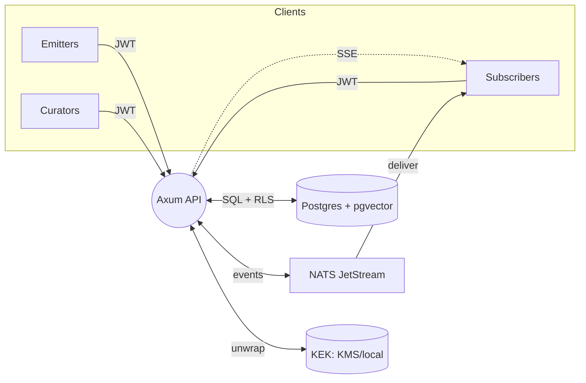

## RCRT Breadcrumbs System Design (v1)

### Purpose
Deliver a production-grade, self-contained Right Context Right Time (RCRT) system using persistent, minimal context packets called breadcrumbs. The system enables agents to publish, subscribe, and react to context changes with strong isolation, fine-grained access control, durable eventing, built-in embeddings, and secure secret management. No mocks or hidden fallbacks; all components are real and deployable.

### Core Concepts
- **Breadcrumb**: Minimal, persistent context packet optimized for LLMs and automations.
- **Emitters**: Agents that create/update breadcrumbs.
- **Subscribers**: Agents that receive updates for breadcrumbs (by ID or selector).
- **Curators**: Agents with elevated privileges to manage metadata and subscriptions.
- **Views**: Context view (minimal for LLMs) vs Full view (operational metadata, privileged).

### v1 Scope and Requirements
- **Functional**
  - CRUD for breadcrumbs with versioning, history, and TTL expiry.
  - Two views: `/breadcrumbs/:id` (context) and `/breadcrumbs/:id/full` (privileged).
  - Subscriptions: direct by ID and selector-based (tags/schema/context-path).
  - Event delivery: NATS JetStream (primary), SSE stream, and webhooks with retries.
  - AuthN/AuthZ: JWT for agents; RLS tenant isolation; per-breadcrumb ACLs for fine-grained and cross-tenant sharing; roles (emitter, subscriber, curator).
  - Embeddings: pgvector from day one; pluggable embedding providers; vector search endpoint.
  - Secrets: envelope encryption, rotation, audit; no plaintext storage.

- **Non-Functional**
  - Performance: p50 API < 20ms, p95 < 100ms for cache/local; p50 event fanout < 50ms within cluster.
  - Reliability: At-least-once event delivery; idempotent handlers; durability via JetStream and DB.
  - Scalability: Horizontally scalable stateless API; NATS and Postgres scale independently.
  - Observability: Structured logs, metrics, tracing; audit logs for sensitive ops.
  - Portability: Single static binary, Docker, Compose, Helm; runs local and cloud.
  - Security: TLS, JWT validation, HMAC webhooks, RLS + ACL, secrets encryption.

### Architecture Overview
- **Service**: Rust (Axum + Tokio) for networked mode. Embedded in-process SDK (Rust crate) is the default integration path. Optional gRPC (tonic) for service-to-service scenarios.
- **Database**: Postgres with `pgvector` extension. JSONB for `context`. RLS for tenant isolation.
- **Event Bus**: NATS JetStream for durable streams/consumers. No automatic or hidden fallbacks.
- **Embeddings**: Local ONNX model default (MiniLM L6 v2, 384d), configurable providers; batch and sync modes.
- **Secrets**: Envelope encryption service with KEK from cloud KMS or local keyfile.



### Embedded vs Networked Modes and SDKs
- **Embedded (default)**
  - Link the `rcrt-core` Rust crate directly into your process.
  - Use in-process APIs for CRUD, selectors, event handling, and embeddings. No network hop.
  - Still connects to real Postgres and NATS (local or remote). No mocks, no automatic fallback to networked mode.
- **Networked service**
  - Run `rcrt-server` as a separate process or sidecar exposing HTTP/SSE (and optional gRPC).
  - Use generated clients (OpenAPI) for TypeScript/Python/Rust.
- **Choice guidance**
  - Prefer Embedded for Rust systems and low-latency, single-binary deployments.
  - Prefer Networked for polyglot environments, centralized RCRT, or when sharing across many services.

### Data Model (Relational + Vector)
- `tenants(id, name, created_at)`
- `agents(id, owner_id, agent_key, roles[], webhook_secret, created_at)`
- `breadcrumbs(id, owner_id, title, context jsonb, tags[], schema_name, visibility, sensitivity, version, checksum, ttl, created_at, updated_at, created_by, updated_by, size_bytes, embedding vector(N))`
- `breadcrumb_history(breadcrumb_id, version, context, updated_at, updated_by, checksum)`
- `subscriptions(id, owner_id, breadcrumb_id?, agent_id, channels jsonb, created_at)`
- `selector_subscriptions(id, owner_id, agent_id, selector jsonb, created_at)`
- `acl_entries(id, owner_id, breadcrumb_id, grantee_agent_id?, grantee_owner_id?, actions[], created_at)`
- `secrets(id, owner_id, name, scope_type, scope_id, enc_blob bytea, dek_encrypted bytea, kek_id, created_at, updated_at, last_rotation_at)`

Indexes: `owner_id`, GIN(tags), `schema_name`, `updated_at`, `ttl`, IVFFLAT(embedding vector_cosine_ops).

RLS: set `app.current_owner_id` and `app.current_agent_id` per connection; policies enforce tenant isolation and ACL-aware exceptions.

### Access Control
- **RLS (Row-Level Security)**: Default tenant isolation; rows only visible if `owner_id = current_owner_id`.
- **ACLs (per-breadcrumb)**: Optional cross-tenant or intra-tenant grants per action: `read_context`, `read_full`, `update`, `delete`, `subscribe`.
- **Policy sketch**:
  - Allow read if owner matches OR ACL exists for `(agent_id OR owner_id)` with relevant action.
  - Full view requires `read_full` or `curator` + sensitivity policy.

### Breadcrumb Schema (API views)
- Context view (minimal):
  - `id`, `title`, `context` (redacted/minimized), `tags`, `version`, `updated_at`.
- Full view (privileged):
  - Adds: `owner_id`, `visibility`, `sensitivity`, `ttl`, `created_at/by`, `updated_at/by`, `checksum`, `schema_name`, `history` (optional), `subscribers`, `policy`.

### Selectors (v1)
Selector JSON supports:
```json
{
  "any_tags": ["travel", "dates"],
  "all_tags": ["profile"],
  "schema_name": "user.allergies.v1",
  "owner_id": "tenant_acme",
  "sensitivity_in": ["low", "pii"],
  "visibility_in": ["team", "public"],
  "context_match": [
    { "path": "$.timezone", "op": "eq", "value": "Europe/London" },
    { "path": "$.allergens[*]", "op": "contains_any", "value": ["nuts", "shellfish"] }
  ]
}
```

### API Surface (HTTP)
- Breadcrumbs
  - `POST /breadcrumbs` create (idempotency key supported)
  - `GET /breadcrumbs/:id` context view
  - `GET /breadcrumbs/:id/full` full view (privileged)
  - `PATCH /breadcrumbs/:id` update with `If-Match`/version
  - `DELETE /breadcrumbs/:id` soft delete
  - `GET /breadcrumbs` list/search filters: `tags`, `schema_name`, `owner_id`, `updated_since`, `q`, `nn`, `query_embedding`
  - `GET /breadcrumbs/:id/history`
- Subscriptions
  - `POST /breadcrumbs/:id/subscribe`
  - `POST /breadcrumbs/:id/unsubscribe`
  - `POST /subscriptions/selectors` (create/update selector subscription)
  - `GET /subscriptions`
- Events
  - `GET /events/stream` (SSE)
  - Webhooks: `POST /agents/:id/webhooks` register `{ delivery_url, secret? }`
- Agents/Access
  - `POST /agents`
  - `GET /agents/me`
  - `POST /acl/grant` / `POST /acl/revoke`
- Health
  - `GET /health`

Authentication: JWT (RS256/EdDSA). Required claims: `sub` (agent), `owner_id`, `roles[]`. The service maps to `app.current_owner_id`/`app.current_agent_id`.

Idempotency: `Idempotency-Key` header for POST/PATCH. Concurrency: `If-Match: W/"<version>"`.

### Eventing
- **Bus (NATS JetStream)**
  - Subjects: `bc.<id>.updated`, `bc.tags.<tag>.updated`, `selectors.<selector_id>.matched`, `agents.<agent_id>.events`
  - Durable consumers per agent or group; at-least-once delivery.
- **SSE**: Real-time stream of authorized events; clients can resume via last event ID/version.
- **Webhooks**: Batched with exponential backoff, max attempts; HMAC signature with per-agent secret.

Event payload (minimal):
```json
{
  "type": "breadcrumb.updated",
  "breadcrumb_id": "bc_123",
  "version": 4,
  "tags": ["travel", "dates"],
  "schema_name": "travel.dates.v1",
  "updated_at": "2025-08-08T12:12:55Z",
  "context": { "start_date": "2025-10-20", "end_date": "2025-10-28" }
}
```

### Embeddings (pgvector)
- Default local model: ONNX MiniLM L6 v2 (384d), CPU-friendly and fast. Reference: [onnx-models/all-MiniLM-L6-v2-onnx on Hugging Face](https://huggingface.co/onnx-models/all-MiniLM-L6-v2-onnx).
- Configurable `EMBED_DIM` and provider (local onnx, remote API, or custom).
- Index: IVFFLAT cosine with suitable lists and probes for target latency.
- API: `GET /breadcrumbs?nn=K&query_embedding=[...]&filters...` returns nearest neighbors with scores.

### Secrets Management
- Envelope encryption: per-secret DEK; `enc_blob = Encrypt(DEK, value)`, `dek_encrypted = Encrypt_KEK(DEK)`.
- KEK providers: AWS KMS, GCP KMS, Azure KeyVault, or local file-based key (age/libsodium).
- Rotation: rewrap DEK with new KEK; optional re-encrypt value.
- Access: Only service role can unwrap; agents receive short-lived tokens or handles; all decrypts audited.

### Redaction and Sensitivity
- `sensitivity`: `low | pii | secret` governs redaction.
- Context view auto-redacts fields per breadcrumb `policy.redact_in_context` and global rules for `pii/secret`.

### Validation & Guardrails
- Strict payload size caps (`size_bytes`); reject oversized `context`.
- Optional JSON Schema per breadcrumb for `context` validation on write.
- Delivery throttling per `policy.delivery_throttle_ms` to limit churn.

### Configuration
- Env vars (examples):
  - `DB_URL`, `NATS_URL`, `JWT_ISSUER`, `JWT_AUDIENCE`
  - `EMBED_PROVIDER=onnx|remote`, `EMBED_DIM=384`, `EMBED_MODEL_PATH=/models/minilm.onnx`
  - `KEK_PROVIDER=aws-kms|gcp-kms|azure-kv|file`, `KEK_REF` (ARN/resource/path)
  - `MAX_CONTEXT_BYTES=8192`, `EVENT_BATCH_SIZE=100`, `WEBHOOK_MAX_RETRIES=12`

### Deployment
- **Docker**: Single static binary image with non-root user; multi-stage build.
- **Compose**: Postgres + NATS + service for local dev; seed scripts for extensions.
- **Helm**: Charts with values for secrets, resources, autoscaling, liveness/readiness, PDB, TLS, NATS stream configs.

### Observability
- Logs: JSON structured, request IDs, user/agent id, redaction of secrets.
- Metrics: Prometheus endpoints (HTTP latencies, DB, NATS, webhook success/failure, vector search p95).
- Tracing: OpenTelemetry spans for API, DB, bus; baggage includes breadcrumb IDs (scrubbed).
- Audit: Immutable log for ACL changes, secret decrypts, full-view reads.

### Testing Strategy
- Unit tests: domain logic, ACL checks, selector matching.
- Integration tests: API + DB + NATS using testcontainers; SSE and webhooks with retry assertions.
- Performance: k6/gatling scenarios for CRUD, fanout, vector search.
- Chaos: NATS/DB disruptions; at-least-once with idempotency verification.
- Security: JWT validation, RLS policy tests, secrets leak prevention, permission matrix.

### Rollout & Migration
- Migrations via `sqlx migrate`; run pre-deploy; backward-compatible changes first.
- Versioned APIs: avoid breaking changes; add fields with defaults; feature flags for new selectors.
- Zero-downtime deploy: graceful shutdown, in-flight request drain, consumer rebalancing.

### Failure Handling (No Hidden Fallbacks)
- Bus adapter chosen explicitly per deploy; no automatic fallback.
- Write paths fail fast with clear errors; retries governed by client policies.
- Webhooks retried with backoff; dead-letter queue (NATS stream) for manual ops.

### Minimal Examples
- Create breadcrumb (POST `/breadcrumbs`):
```json
{
  "title": "Travel Dates",
  "context": {"start_date": "2025-10-20", "end_date": "2025-10-28", "timezone": "Europe/London"},
  "tags": ["travel","dates"],
  "schema_name": "travel.dates.v1",
  "visibility": "team",
  "sensitivity": "low",
  "ttl": "2025-11-15T00:00:00Z"
}
```

- Selector subscription:
```json
{
  "agent_id": "<uuid>",
  "selector": {
    "all_tags": ["travel"],
    "context_match": [{"path": "$.timezone", "op": "eq", "value": "Europe/London"}]
  },
  "channels": {"bus": true}
}
```

### Prompt Templates (Agents)
- Subscriber prompt snippet:
```text
You receive minimal context packets called breadcrumbs.
- Use only the context-view fields to decide actions.
- If additional detail is required, request the full view by ID using your client.
- Track versions and ignore stale updates.
- Do not persist sensitive data beyond the action window.
```

### Phases of Work (Execution Plan)
1) Core domain and schema (pgvector, RLS, ACL tables) with migrations
2) Axum service scaffold: JWT middleware, context/full endpoints, history, list/search
3) NATS JetStream adapter and event emission on version bumps; SSE server
4) Subscriptions: direct and selector-based; selector evaluator; persist and match
5) Webhooks dispatcher with retries, HMAC signing, dead-letter stream
6) Embeddings provider interface; ONNX MiniLM integration; vector search endpoints
7) Secrets service: envelope encryption, KEK backends, rotation APIs, audit
8) OpenAPI 3.1 spec; generate SDKs (TS/Python/Rust); publish examples
9) Observability: metrics, tracing, structured logs, audit pipeline
10) Packaging: Dockerfile, Compose (Postgres+NATS), Helm chart; SRE runbook
11) Tests: unit/integration/perf/chaos/security; CI pipelines; release gates

### Risks & Mitigations
- Selector complexity → Start with bounded ops (eq, contains_any, gt/lt) and cache compiled JSONPaths.
- Event overload → Per-breadcrumb throttling and coalescing; consumer backpressure using JetStream.
- Cross-tenant sharing pitfalls → Explicit ACL grants; audit trails; deny by default.
- Secrets sprawl → Namespaced scopes; rotation policies; least-privilege access.

### References
- Embedding model (local, ONNX, 384d): [onnx-models/all-MiniLM-L6-v2-onnx on Hugging Face](https://huggingface.co/onnx-models/all-MiniLM-L6-v2-onnx)


