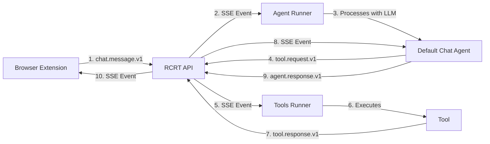

# RCRT Chat Setup Guide

## Overview

RCRT Chat is a browser extension that provides direct access to your AI assistant powered by the Right Context Right Time system. It integrates seamlessly with RCRT agents and tools, allowing you to chat and execute tasks right from your browser.

## Prerequisites

1. **RCRT System Running**
   - PostgreSQL database
   - NATS messaging
   - RCRT API server
   - Agent runner
   - Tools runner

2. **OpenRouter API Key** (for LLM access)

## Setup Steps

### 1. Add OpenRouter API Key

First, set your OpenRouter API key as an environment variable:

```bash
export OPENROUTER_API_KEY=sk-or-v1-your-key-here
```

Then run the setup script to add it to RCRT secrets:

```bash
node add-openrouter-key.js
```

This will:
- Create a secure secret in RCRT
- Make it available to the OpenRouter tool
- Require a tools-runner restart to take effect

### 2. Start/Restart Services

```bash
# If not already running, start all services
docker compose up -d

# If already running, just restart tools-runner to pick up the new key
docker compose restart tools-runner
```

### 3. Run Bootstrap (if not already done)

```bash
cd bootstrap-breadcrumbs
npm install
node bootstrap.js
```

This creates:
- Default chat agent
- Tool catalog with transforms
- Template breadcrumbs

### 4. Install the Browser Extension

#### Development Mode
1. Open Chrome/Edge and go to `chrome://extensions/`
2. Enable "Developer mode" (top right)
3. Click "Load unpacked"
4. Select the `extension/dist` folder

#### Build from Source
```bash
cd extension
npm install
npm run build
```

### 5. Using RCRT Chat

1. Click the RCRT Chat extension icon in your browser toolbar
2. The extension will automatically connect to your local RCRT instance
3. Start chatting! The AI assistant can:
   - Answer questions
   - Execute tools (file storage, web search, calculations)
   - Maintain conversation context
   - Show tool execution status

## Features

### 🎯 Direct RCRT Integration
- Creates `chat.message.v1` breadcrumbs for user input
- Listens to `agent.response.v1` via Server-Sent Events
- Shows tool invocations and responses

### 🛠️ Tool Support
The default agent can use any tools registered in the system:
- **OpenRouter**: Access to 100+ LLM models
- **File Storage**: Store and retrieve files
- **Web Search**: Search the web (requires SERPAPI_API_KEY)
- **Calculations**: Basic math operations
- **And more**: Any tools you add to the system

### 🔐 Security
- Uses JWT authentication with RCRT
- Secrets are encrypted and stored securely
- Each session has a unique ID for tracking

### 🎨 User Experience
- Clean, modern dark theme UI
- Real-time connection status
- Message timestamps and breadcrumb IDs
- Copy breadcrumb IDs for debugging
- Auto-resizing input field
- Keyboard shortcuts (Enter to send)

## Troubleshooting

### "Failed to connect to RCRT"
1. Check if RCRT is running: `docker compose ps`
2. Verify the API is accessible: `curl http://localhost:8081/health`
3. Check agent-runner logs: `docker compose logs agent-runner`

### "401 Unauthorized on SSE"
This has been fixed! The extension now properly authenticates SSE connections by:
- Passing the JWT token as a query parameter
- RCRT server accepts `?token=` for SSE/browser clients
- Rebuild the extension if you see this error: `npm run build`

### "No agent response"
1. Ensure the default chat agent exists:
   ```bash
   curl -H "Authorization: Bearer $(node -e "console.log(require('./token.json').token)")" \
        http://localhost:8081/breadcrumbs?schema_name=agent.def.v1
   ```
2. Check if agent-runner is processing messages:
   ```bash
   docker compose logs -f agent-runner
   ```

### "Tool not found"
1. Check tools-runner has registered tools:
   ```bash
   docker compose logs tools-runner | grep "Registered tool"
   ```
2. Verify tool catalog exists and has llm_hints
3. Restart tools-runner if needed

### "OpenRouter API key error"
1. Verify the secret was created:
   ```bash
   # List secrets (requires auth)
   curl -H "Authorization: Bearer YOUR_TOKEN" \
        http://localhost:8081/secrets?scope_type=tool
   ```
2. Restart tools-runner after adding the key
3. Check tools-runner logs for key issues

## Advanced Usage

### Custom Agents
You can create custom agents that respond to chat messages:

```javascript
// Via Dashboard or API
{
  "schema_name": "agent.def.v1",
  "title": "My Custom Assistant",
  "tags": ["agent:def", "workspace:agents"],
  "context": {
    "agent_id": "my-custom-assistant",
    "model": "openrouter/anthropic/claude-3-opus",
    "system_prompt": "You are a specialized assistant for...",
    "subscriptions": {
      "selectors": [
        {
          "schema_name": "chat.message.v1",
          "all_tags": ["workspace:agents"]
        }
      ]
    }
  }
}
```

### Adding New Tools
Tools are automatically discovered by agents through the tool catalog. To add a new tool:

1. Register it with the tools-runner
2. It will appear in the tool catalog
3. Agents will see it via the transformed catalog view

### Session Management
Each chat session has a unique ID. You can:
- Track conversations across breadcrumbs
- Resume sessions (future feature)
- Correlate tool requests and responses

## Architecture



## Next Steps

1. **Customize the Agent**: Modify the system prompt or model in the default chat agent
2. **Add More Tools**: Integrate additional tools for your specific needs
3. **Create Workflows**: Build multi-step agent workflows triggered by chat
4. **Enhance the UI**: The extension is built with React and can be customized

Enjoy your AI-powered browser assistant! 🚀
