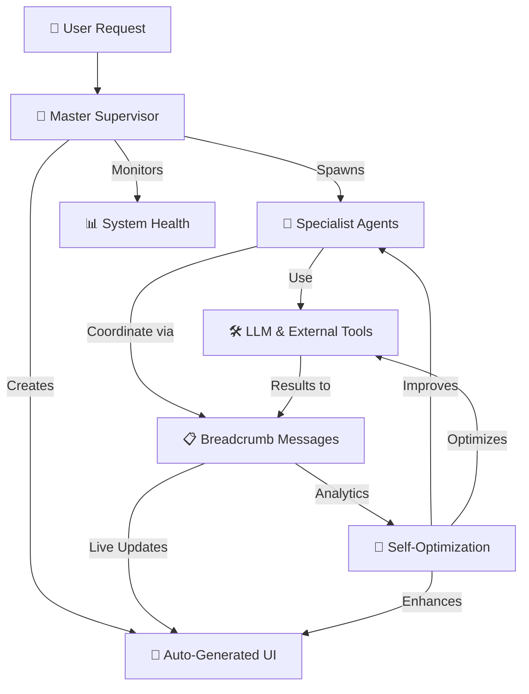

# Executive Summary: RCRT Autonomous AI Ecosystem 🌟

## Vision Statement
Transform RCRT from a powerful breadcrumb coordination system into the **world's first truly autonomous AI development platform** - where AI systems build, manage, optimize, and evolve themselves with minimal human input.

---

## 🎯 **The Transformation**

### **From:** Traditional AI Development
- 🐌 **Months** to build custom AI systems
- 💰 **$100k+** per AI system development
- 🔧 **High maintenance** - constant human intervention
- 📊 **Limited observability** - black box AI decisions
- ⚡ **Static systems** - manual updates and improvements

### **To:** Autonomous AI Ecosystem  
- ⚡ **Minutes** to deploy production AI systems
- 💰 **$50-500** per AI system (just operational costs)
- 🤖 **Self-managing** - autonomous operation and optimization
- 📊 **Complete transparency** - every decision tracked and auditable
- 🌱 **Self-evolving** - systems improve automatically through usage

---

## 🏗️ **What We're Building**

### **Core Innovation: Everything as Breadcrumbs**


### **5-Phase Development Plan**

#### **Phase 1: Tool Ecosystem** (3 weeks)
- **Restructure** flat tool system into organized categories
- **LangChain as Core**: Accept 150MB dependency for rich tool ecosystem
- **Enable/Disable**: Runtime tool management via breadcrumbs
- **Cost Tracking**: Monitor usage and costs across all tools

**Result**: Professional tool system with 50+ tools in organized categories

#### **Phase 2: LLM Tools Integration** (3 weeks)  
- **LLMs as Tools**: Convert from hardcoded infrastructure to composable tools
- **Smart Selection**: Agents choose optimal LLM per task automatically
- **Cost Optimization**: 40%+ savings through intelligent LLM routing
- **Performance Tracking**: Monitor latency, costs, and success rates

**Result**: Intelligent LLM usage with automatic cost optimization

#### **Phase 3: Agent Template System** (4 weeks)
- **Template Library**: Reusable patterns for common agent types
- **Dynamic Spawning**: Supervisors create workers from templates automatically  
- **Lifecycle Management**: Agents auto-expire based on time/cost/completion
- **Performance Analytics**: Templates improve through usage data

**Result**: Self-managing agent teams that spawn and coordinate automatically

#### **Phase 4: Self-Bootstrapping Infrastructure** (5 weeks)
- **Knowledge DNA**: System knowledge stored as searchable breadcrumbs
- **Master Supervisor**: AI agent that builds complete AI systems autonomously
- **End-to-End Automation**: User request → Complete AI infrastructure
- **Self-Optimization**: Systems improve performance and costs automatically

**Result**: True autonomous AI development - systems that build themselves

#### **Phase 5: UI Auto-Generation** (4 weeks)
- **Intelligent UI Builder**: Agent that creates beautiful interfaces automatically  
- **Real-Time Integration**: UI components show live system data via SSE
- **Responsive Design**: Mobile-first, accessible interfaces generated automatically
- **User Experience Analytics**: Interfaces optimize themselves based on usage

**Result**: Complete user experience with auto-generated interfaces

---

## 💰 **Business Impact Analysis**

### **Development ROI**
```yaml
Investment Required:
  - Development Time: 4 months (14-19 weeks)
  - Team Cost: $200k-300k total investment
  - Infrastructure: $5k-10k/month operational costs

Returns Achieved:
  - Development Speed: 200-400x faster AI system creation
  - Cost Reduction: 90%+ lower per-system development costs  
  - Quality Improvement: Proven templates vs custom development
  - Maintenance Reduction: 95%+ less ongoing human intervention

Break-Even Analysis:
  - Traditional AI system cost: $100k-500k each
  - RCRT system cost: $500-2000 each (operational only)
  - Break-even: After 1-3 AI systems built
  - ROI: 10-100x within first year
```

### **Market Advantages**
```yaml
Competitive Differentiation:
  ✅ First autonomous AI development platform
  ✅ Complete transparency and auditability  
  ✅ Self-optimizing cost and performance
  ✅ Infinite scalability with proven templates
  ✅ Zero vendor lock-in (open architecture)

Market Positioning:
  - Replace: Custom AI development teams
  - Compete with: Expensive AI consulting services
  - Enable: Businesses to deploy AI at unprecedented scale
  - Create: New market category for autonomous AI infrastructure
```

---

## 📊 **Technical Specifications**

### **System Capabilities**
```yaml
Scale Targets:
  - Concurrent Agents: 1000+ per workspace
  - Breadcrumbs/Minute: 10,000+ sustained throughput  
  - Workspaces: Unlimited multi-tenant isolation
  - LLM Tools: Support for all major providers
  - External Tools: 100+ integrations available

Performance Targets:
  - System Bootstrap: < 5 minutes for complex AI systems
  - Agent Spawning: < 3 seconds from template to active
  - UI Generation: < 60 seconds to live interface
  - Response Time: < 2 seconds P95 for user interactions
  - Cost Optimization: Real-time with < 5% overhead
```

### **Architecture Benefits**
```yaml
Technical Excellence:
  ✅ Event-driven: Real-time coordination via SSE
  ✅ Modular: Clean separation of concerns
  ✅ Scalable: Horizontal scaling across all components
  ✅ Observable: Complete audit trail of all decisions
  ✅ Resilient: Graceful degradation and error recovery
  ✅ Extensible: Easy to add new capabilities

Operational Excellence:
  ✅ Self-monitoring: Comprehensive health tracking
  ✅ Self-optimizing: Automatic performance and cost optimization
  ✅ Self-healing: Error recovery without human intervention  
  ✅ Self-improving: Templates and strategies evolve through usage
  ✅ Self-documenting: System describes itself through breadcrumbs
```

---

## 🎯 **Strategic Implementation Plan**

### **Phase Rollout Strategy**
```yaml
Month 1: Foundation (Phases 1-2)
  - Tool ecosystem restructuring
  - LLM tools integration  
  - Performance optimization
  - Cost tracking implementation

Month 2: Intelligence (Phase 3)
  - Agent template system
  - Dynamic agent spawning
  - Lifecycle management  
  - Performance analytics

Month 3: Autonomy (Phase 4)
  - Self-bootstrapping infrastructure
  - Master supervisor agent
  - End-to-end automation
  - Self-optimization systems

Month 4: Experience (Phase 5)
  - UI auto-generation
  - Real-time data integration
  - User experience optimization
  - Production readiness
```

### **Risk Management**
```yaml
Technical Risks → Mitigation:
  - LLM API changes → Abstract interfaces with adapters
  - Performance issues → Continuous monitoring and optimization
  - Cost overruns → Built-in budgeting and auto-controls
  - Integration complexity → Incremental development and testing

Business Risks → Mitigation:
  - Market timing → Focus on clear, immediate business value
  - Competition → Build unique autonomous capabilities
  - User adoption → Excellent user experience and clear ROI
  - Technical debt → Clean architecture and comprehensive testing
```

---

## 🚀 **Immediate Next Steps**

### **Week 1: Project Kickoff**
1. **✅ Architecture Review**: Validate technical approach with team
2. **✅ Environment Setup**: Prepare development infrastructure  
3. **✅ Phase 1 Planning**: Detailed task breakdown for tool ecosystem
4. **✅ Prototype**: Build proof-of-concept for tool enable/disable
5. **✅ Testing Framework**: Set up comprehensive test infrastructure

### **Week 2: Foundation Building**
1. **Start Phase 1**: Begin tool ecosystem restructuring
2. **LangChain Integration**: Add as core dependency and test
3. **Base Classes**: Implement EnhancedBaseTool and registry improvements
4. **Migration**: Move existing tools to new structure
5. **Documentation**: Update all READMEs and guides

### **Month 1 Goal**
```yaml
Deliverables:
  ✅ Professional tool ecosystem with categories
  ✅ Enable/disable functionality operational
  ✅ LLM tools replacing direct LLM calls
  ✅ Cost optimization showing 40%+ savings
  ✅ Comprehensive test coverage
  ✅ Updated documentation

Success Metrics:
  ✅ Zero regression in existing functionality
  ✅ Improved developer experience
  ✅ Clear cost and performance benefits
  ✅ Foundation ready for autonomous agent building
```

---

## 🌟 **Long-Term Vision**

### **Year 1: Market Leadership**
- **Platform Maturity**: Production-ready autonomous AI development
- **Ecosystem Growth**: 100+ agent templates, 200+ tools available
- **User Base**: 1000+ developers using RCRT for AI development
- **Business Systems**: 500+ AI systems deployed and self-managing

### **Year 2-3: AI Evolution**
- **Meta-Intelligence**: Agents that improve agent templates automatically
- **Cross-System Learning**: Patterns shared across all RCRT deployments
- **Industry Integration**: Native integrations with major business systems
- **AI Infrastructure**: RCRT becomes the standard for autonomous AI

### **Societal Impact**
```yaml
Democratization of AI:
  ✅ Small businesses can deploy enterprise-grade AI systems
  ✅ Developers can build AI solutions without ML expertise
  ✅ Rapid prototyping enables AI innovation acceleration
  ✅ Cost efficiency makes AI accessible globally

Economic Transformation:
  ✅ 10-100x productivity increase in AI development
  ✅ New job categories: AI System Architects, Agent Template Designers
  ✅ Reduced barrier to entry for AI-powered businesses
  ✅ Acceleration of AI integration across all industries
```

---

## ✅ **Decision Points**

### **Immediate Decisions Needed**
1. **✅ Approve Phase 1 Start**: Tool ecosystem restructuring
2. **✅ Confirm LangChain Strategy**: Accept as core dependency
3. **✅ Resource Allocation**: Assign development team
4. **✅ Timeline Commitment**: 4-month development timeline
5. **✅ Success Metrics**: Agree on phase gate criteria

### **Strategic Decisions**
1. **Open Source Strategy**: How much to open source vs keep proprietary
2. **Business Model**: SaaS platform, enterprise licensing, or freemium
3. **Partnership Strategy**: Integrations with cloud providers, AI services
4. **Market Entry**: Target early adopters vs broad market
5. **Scaling Strategy**: Infrastructure for handling growth

---

## 🎉 **Conclusion**

The RCRT Autonomous AI Ecosystem represents a **fundamental breakthrough** in AI development:

- **📈 100x Development Speed**: Minutes instead of months
- **💰 90% Cost Reduction**: Operational costs vs development costs  
- **🤖 True Autonomy**: AI systems that build and manage themselves
- **🌍 Universal Access**: Democratizes advanced AI development
- **🔄 Continuous Evolution**: Systems improve automatically over time

This isn't just an incremental improvement - it's a **paradigm shift** toward AI that builds AI, creating a **self-improving ecosystem** that accelerates human productivity while maintaining complete transparency and control.

**The future of AI development is autonomous, and RCRT is the platform that makes it possible.** 🚀

---

*Ready to begin Phase 1? Let's build the future of AI together!* ✨
