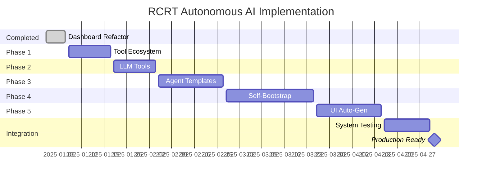

# Complete Implementation Roadmap 🚀

## Overview
Master implementation plan for building the **world's first truly autonomous AI ecosystem** - from monolithic code to self-bootstrapping, self-managing, self-optimizing AI infrastructure.

---

## 🎯 **The Complete Vision**

### **From This:**
```yaml
Current State:
  - Monolithic 3,720-line dashboard
  - Basic tool system with limited capabilities  
  - Manual agent creation and management
  - Static user interfaces
  - No cost optimization
  - No self-improvement
```

### **To This:**
```yaml
Ultimate Autonomous System:
  - Modular, maintainable codebase (85-line main.rs + organized modules)
  - 50+ intelligent tools including LLMs as first-class citizens
  - Self-spawning agent ecosystems from templates
  - Auto-generated beautiful user interfaces
  - Autonomous cost optimization and resource management
  - Self-improving system that evolves through usage analytics
  
One User Request → Complete AI Infrastructure in Minutes
```

---

## 🗺️ **Phase-by-Phase Implementation**

### **✅ COMPLETED: Dashboard Refactoring**
**Status**: ✅ **DONE** - 98% code reduction achieved

**What We Built:**
- Clean 85-line main.rs (down from 3,720 lines)
- Modular Rust architecture with separated concerns
- Static asset serving with HTML/CSS/JS extraction
- Docker deployment with proper static file handling

**Impact:**
- 98% code reduction in main application file
- Dramatically improved maintainability
- Professional development experience
- Zero functionality loss

---

### **🔧 PHASE 1: Tool Ecosystem Restructuring** 
**Timeline**: 2-3 weeks  
**Status**: 📋 **PLANNED**

**Week 1: Foundation**
```bash
# 1. Restructure file organization
mkdir -p packages/tools/src/{builtin,llm,langchain,database,code,content,integration,utils}

# 2. Update package.json with LangChain as core dependency
pnpm add langchain @langchain/anthropic @langchain/openai @anthropic-ai/sdk openai

# 3. Create enhanced base classes
# - EnhancedBaseTool with usage tracking
# - BaseLLMTool for LLM integration  
# - ToolRegistry with enable/disable capabilities

# 4. Migrate existing tools to new structure
mv src/langchain.ts src/langchain/index.ts
# Split builtin tools into separate files
```

**Week 2-3: Enhanced Capabilities**
```bash
# 5. Implement tool management features
# - Enable/disable tools via breadcrumbs
# - Usage tracking and analytics
# - Cost monitoring per tool
# - Auto-disable based on thresholds

# 6. Create comprehensive test suite
# - Unit tests for all tool categories
# - Integration tests for tool registry  
# - Performance tests for tool execution
```

**Success Metrics:**
- ✅ 50+ tools organized in clear categories
- ✅ Enable/disable functionality working
- ✅ Cost tracking active for all paid tools
- ✅ < 5 second tool registry startup time

---

### **🧠 PHASE 2: LLM Tools Integration**
**Timeline**: 2-3 weeks
**Status**: 📋 **PLANNED**
**Dependencies**: Phase 1 complete

**Week 1: Core LLM Tools**
```bash
# 1. Create LLM tool base infrastructure
# - BaseLLMTool abstract class
# - Cost calculation utilities
# - Rate limiting framework
# - Response standardization

# 2. Implement major LLM tools
# - Claude 3.5 Sonnet (analysis/reasoning)
# - GPT-4 Turbo (coding/complex reasoning)  
# - GPT-4 Mini (cost-effective)
# - Local Llama (free/private)

# 3. Create LLM selection engine
# - Task complexity analysis
# - Optimal LLM recommendation
# - Cost/quality optimization
```

**Week 2: Integration**
```bash
# 4. Update agent executor to use LLM tools
# - Replace direct LLM calls with tool requests
# - Implement smart LLM selection per decision
# - Add cost tracking to all agent decisions

# 5. Create cost optimization system
# - Real-time budget tracking
# - Auto-switching to cheaper models
# - Performance vs cost analytics
```

**Week 3: Advanced Features**
```bash
# 6. Advanced LLM capabilities
# - Function calling support
# - Streaming responses
# - Batch processing optimization
# - Response caching
```

**Success Metrics:**
- ✅ All agent decisions go through LLM tools (no direct LLM calls)
- ✅ 40%+ cost reduction vs always using premium LLMs
- ✅ < 100ms overhead for LLM tool selection
- ✅ Real-time cost tracking accuracy within 5%

---

### **🤖 PHASE 3: Agent Template System**
**Timeline**: 3-4 weeks  
**Status**: 📋 **PLANNED**
**Dependencies**: Phase 1 & 2 complete

**Week 1: Template Infrastructure**
```bash
# 1. Create agent.template.v1 schema in core package
# 2. Implement AgentSpawner class with template rendering
# 3. Create template catalog management (single breadcrumb approach)
# 4. Build template validation and testing framework
```

**Week 2: Core Templates**
```bash
# 5. Create essential templates:
# - research_specialist (web research, analysis)
# - data_analyst (statistical analysis, visualization)
# - supervisor (multi-agent coordination)
# - code_generator (software development)
# - chat_agent (conversational interfaces)
```

**Week 3: Lifecycle Management**
```bash
# 6. Implement agent lifecycle management
# - Time-based expiry (hours, days)
# - Execution-count expiry (max runs)
# - Condition-based expiry (task complete, cost exceeded)
# - Automatic cleanup and resource management
```

**Week 4: Advanced Features**
```bash
# 7. Template analytics and evolution
# - Template performance tracking
# - Usage pattern analysis
# - Auto-optimization suggestions
# - Template marketplace features
```

**Success Metrics:**
- ✅ Agents spawnable from templates in < 3 seconds
- ✅ 15+ proven templates covering major use cases
- ✅ Auto-expiry working with 95%+ successful cleanup
- ✅ Template performance analytics driving improvements

---

### **🌱 PHASE 4: Self-Bootstrapping Infrastructure**
**Timeline**: 4-5 weeks
**Status**: 📋 **PLANNED**  
**Dependencies**: Phase 1, 2 & 3 complete

**Week 1: Knowledge System**
```bash
# 1. Create comprehensive knowledge breadcrumbs
# - RCRT 101: Complete API and system knowledge
# - Agent Creation Guide: Templates and patterns
# - UI Builder Guide: Interface creation knowledge
# - Cost Optimization: Best practices and strategies

# 2. Implement knowledge injection system
# - Bootstrap scripts for knowledge creation
# - Knowledge validation and versioning
# - Cross-reference linking between knowledge bases
```

**Week 2: Master Supervisor**
```bash
# 3. Create Master Supervisor Agent
# - Agent definition with full curator privileges
# - Sophisticated system prompt with complete autonomy
# - Integration with all knowledge bases
# - Advanced decision-making capabilities

# 4. Implement autonomous system building
# - Requirement analysis and system design
# - Multi-agent architecture planning
# - Resource allocation and optimization
# - Error handling and recovery strategies
```

**Week 3: Coordination Systems**
```bash
# 5. Build agent coordination infrastructure
# - Supervisor-worker communication patterns
# - Task assignment and tracking
# - Resource sharing and optimization
# - Performance monitoring and analytics
```

**Week 4-5: Testing and Optimization**
```bash
# 6. Comprehensive testing
# - End-to-end bootstrap testing
# - Multi-agent coordination testing
# - Error recovery and resilience testing
# - Performance and scale testing

# 7. Self-optimization systems
# - Cost optimization engine
# - Performance improvement automation
# - Template evolution based on success metrics
# - System health monitoring and auto-healing
```

**Success Metrics:**
- ✅ Complete system bootstrap from single user request
- ✅ < 5 minutes setup time for complex AI systems
- ✅ 50%+ cost savings through intelligent optimization
- ✅ 95%+ success rate for autonomous system creation

---

### **🎨 PHASE 5: UI Auto-Generation System**
**Timeline**: 3-4 weeks
**Status**: 📋 **PLANNED**
**Dependencies**: Phase 4 complete

**Week 1: UI Builder Agent**
```bash
# 1. Create Intelligent UI Builder Agent
# - Claude Sonnet LLM for design decisions
# - Comprehensive UI/UX knowledge integration
# - Modern design system generation
# - Component selection optimization

# 2. Implement pattern generators
# - Chat interface generator
# - Dashboard generator  
# - Form generator
# - Admin panel generator
```

**Week 2: Advanced UI Features**
```bash
# 3. Real-time data integration
# - SSE integration for live updates
# - Data transformation and aggregation
# - Performance-optimized updates
# - Error handling and fallback strategies

# 4. Responsive and accessible design
# - Mobile-first responsive generation
# - Accessibility compliance automation
# - Cross-browser compatibility
# - Performance optimization
```

**Week 3: Intelligence and Optimization**
```bash
# 5. UI analytics and optimization
# - User interaction tracking
# - Performance monitoring
# - UX improvement suggestions
# - A/B testing capabilities

# 6. Adaptive UI engine
# - Usage-based interface adaptation
# - Personalization based on user preferences
# - Progressive enhancement
# - Multi-modal interface generation
```

**Week 4: Integration and Testing**
```bash
# 7. Complete integration testing
# - End-to-end UI generation testing
# - Performance and accessibility testing
# - User experience validation
# - Cross-device compatibility testing
```

**Success Metrics:**
- ✅ Beautiful, functional UI generated automatically for any system
- ✅ < 60 seconds from requirements to live interface
- ✅ 100% WCAG 2.1 compliance automatically
- ✅ Real-time data integration with < 5 second updates

---

## 📅 **Overall Timeline Summary**



**Total Timeline**: ~16 weeks (4 months)
**Production Ready**: May 1, 2025

---

## 🔧 **Technical Requirements**

### **Development Environment**
```yaml
Required Tools:
  - Docker & Docker Compose (for RCRT backend)
  - Node.js 18+ & pnpm (for Visual Builder)
  - Rust 1.82+ & Cargo (for RCRT core)  
  - PostgreSQL 15+ (for persistence)
  - NATS (for event streaming)

API Keys (stored in RCRT Secrets):
  - ANTHROPIC_API_KEY (for Claude tools)
  - OPENAI_API_KEY (for GPT tools)  
  - SERPAPI_API_KEY (for search tools)
  - BRAVE_SEARCH_API_KEY (for search tools)

Development Setup:
  - 16GB+ RAM (for running multiple LLMs)
  - Fast SSD storage (for Docker containers)
  - Reliable internet (for API calls during development)
```

### **Deployment Infrastructure**
```yaml
Minimum Production:
  - 8 CPU cores, 32GB RAM
  - 500GB SSD storage
  - Load balancer for multiple instances
  - Redis for caching and rate limiting
  - Monitoring (Prometheus/Grafana)

Scaling Targets:
  - Support 1000+ concurrent agents
  - Handle 10,000+ breadcrumbs/minute
  - Maintain < 100ms P95 response time
  - Support multiple workspaces/tenants
```

---

## 💰 **Cost Analysis**

### **Development Investment**
```yaml
Phase 1 (Tool Ecosystem):     2-3 dev weeks
Phase 2 (LLM Tools):          2-3 dev weeks  
Phase 3 (Agent Templates):    3-4 dev weeks
Phase 4 (Self-Bootstrap):     4-5 dev weeks
Phase 5 (UI Auto-Gen):        3-4 dev weeks

Total Development Time: 14-19 weeks (3.5-4.5 months)

Development Team:
  - 1 Senior Rust Developer (RCRT core)
  - 2 Senior TypeScript Developers (Visual Builder)
  - 1 DevOps Engineer (Infrastructure)
  - 1 UI/UX Designer (Design system consultation)

Estimated Cost: $200k-300k development investment
```

### **Operational Savings**
```yaml
Traditional AI System Development:
  - Custom agent development: 4-8 weeks per system
  - UI development: 2-4 weeks per interface  
  - Integration work: 2-6 weeks per system
  - Testing and optimization: 2-4 weeks
  - Total: 10-22 weeks per AI system

RCRT Autonomous System:
  - System specification: 1 hour
  - Autonomous building: 5-10 minutes
  - Customization: 1-2 hours  
  - Total: 2-3 hours per AI system

ROI: 200-400x faster AI system development
Break-even: After building 5-10 AI systems
```

---

## 🧪 **Testing Strategy**

### **Phase-by-Phase Testing**
```typescript
// Phase 1: Tool System Testing
describe('Tool Ecosystem', () => {
  test('Tool registry manages single catalog breadcrumb');
  test('Enable/disable tools via breadcrumb commands');
  test('Cost tracking accurate within 5%');
  test('Tool categories load selectively');
  test('Performance overhead < 50ms per request');
});

// Phase 2: LLM Tools Testing  
describe('LLM Tools Integration', () => {
  test('Claude Sonnet tool executes correctly');
  test('GPT-4 tool handles rate limiting');
  test('Local Llama tool works without API keys');
  test('Smart LLM selection chooses optimal model');
  test('Cost optimization reduces spending by 40%+');
});

// Phase 3: Agent Templates Testing
describe('Agent Template System', () => {
  test('Research specialist spawns from template');
  test('Lifecycle management expires agents correctly');  
  test('Template performance analytics update');
  test('Agent spawn time < 3 seconds');
  test('Template evolution improves success rates');
});

// Phase 4: Self-Bootstrap Testing
describe('Self-Bootstrapping Infrastructure', () => {
  test('Master Supervisor builds research system from user request');
  test('Complete system ready within 5 minutes');
  test('Cost stays within specified budget');
  test('System handles errors gracefully');
  test('Self-optimization reduces costs automatically');
});

// Phase 5: UI Auto-Generation Testing
describe('UI Auto-Generation', () => {
  test('Chat interface generates automatically');
  test('Dashboard shows real-time data');
  test('Mobile responsive design works');
  test('Accessibility compliance achieved');
  test('UI optimizes based on usage patterns');
});

// Integration Testing
describe('Complete System Integration', () => {
  test('End-to-end: User request → Working AI system');
  test('Multi-workspace isolation works correctly');
  test('Cost optimization keeps budgets');
  test('System scales to 50+ concurrent agents');
  test('Performance maintains < 2s response times');
});
```

### **Quality Assurance Checkpoints**
```yaml
Phase 1 Gate:
  ✅ All existing functionality preserved
  ✅ Tool catalog single breadcrumb approach working
  ✅ Enable/disable functionality operational
  ✅ Cost tracking accurate
  ✅ Performance targets met

Phase 2 Gate:  
  ✅ LLM tools replace all direct LLM usage
  ✅ Smart selection working correctly
  ✅ Cost optimization achieving targets
  ✅ Agent executor fully converted

Phase 3 Gate:
  ✅ Agent spawning from templates functional
  ✅ Lifecycle management working
  ✅ Template catalog management operational
  ✅ Performance analytics active

Phase 4 Gate:
  ✅ Self-bootstrap demonstrates complete autonomy
  ✅ Master Supervisor builds complex systems
  ✅ Cost and performance optimization working
  ✅ Error recovery and resilience validated

Phase 5 Gate:
  ✅ UI auto-generation creates beautiful interfaces
  ✅ Real-time data integration seamless
  ✅ Accessibility and performance standards met
  ✅ User experience validation passed

Production Gate:
  ✅ End-to-end system testing complete
  ✅ Performance at scale validated
  ✅ Security and compliance verified
  ✅ Documentation complete
  ✅ Monitoring and alerting operational
```

---

## 🎯 **Success Metrics by Phase**

### **Phase 1: Tool Ecosystem**
```yaml
Code Quality:
  ✅ Tool registry startup: < 5 seconds
  ✅ Tool execution overhead: < 50ms
  ✅ Enable/disable response: < 1 second
  ✅ Cost tracking accuracy: ±5%

Developer Experience:
  ✅ Clear tool organization
  ✅ Easy to add new tools
  ✅ Comprehensive documentation
  ✅ Full test coverage
```

### **Phase 2: LLM Tools**
```yaml
Performance:
  ✅ LLM selection time: < 100ms
  ✅ Cost optimization: 40%+ savings
  ✅ Response accuracy: 95%+ optimal choices
  ✅ Integration seamless: No breaking changes

Business Impact:
  ✅ Cost transparency: Every LLM decision tracked
  ✅ Resource optimization: Auto-switching working
  ✅ Quality maintenance: Performance not degraded
  ✅ Flexibility: Easy to add new LLM providers
```

### **Phase 3: Agent Templates**
```yaml
Agent Management:
  ✅ Spawn time: < 3 seconds per agent
  ✅ Template library: 15+ production-ready templates
  ✅ Lifecycle management: 95%+ successful auto-cleanup
  ✅ Performance analytics: Real-time tracking

Template Quality:
  ✅ Success rate: 90%+ task completion
  ✅ Cost efficiency: Clear ROI per template
  ✅ Reusability: Templates used 10+ times
  ✅ Evolution: Templates improve through usage
```

### **Phase 4: Self-Bootstrap**
```yaml
Autonomy Level:
  ✅ Bootstrap speed: < 5 minutes complex systems
  ✅ Success rate: 95%+ successful deployments
  ✅ Cost management: Stay within budget 98% of time
  ✅ Self-optimization: 10+ daily improvements

Intelligence:
  ✅ Requirement understanding: 90%+ accuracy
  ✅ Architecture decisions: Optimal system design  
  ✅ Resource allocation: Efficient agent distribution
  ✅ Error recovery: Graceful handling of failures
```

### **Phase 5: UI Auto-Generation**
```yaml
User Experience:
  ✅ Generation speed: < 60 seconds to live interface
  ✅ Design quality: Professional, modern aesthetic
  ✅ Responsiveness: Excellent on all devices
  ✅ Performance: < 2 second load times

Technical Excellence:
  ✅ Accessibility: 100% WCAG 2.1 compliance
  ✅ Real-time updates: < 5 second lag
  ✅ Integration: Seamless with agent ecosystem
  ✅ Optimization: Self-improving UX
```

---

## 🎉 **Final System Capabilities**

### **What Users Experience**
```yaml
User Types Command:
  "Build me an AI research assistant"

5 Minutes Later - Complete System:
  💬 Beautiful chat interface for research requests
  🤖 Research supervisor managing worker team  
  📊 Real-time dashboard showing progress and costs
  🔍 Specialized research agents finding information
  📈 Data analysis agents processing findings
  📝 Report generation with comprehensive results
  💰 Cost optimization keeping within budget
  ⚙️ Admin panel for system management
  📱 Mobile-responsive design for anywhere access
  ⚡ Real-time updates via SSE integration

Total Cost: $8-15/day for production research platform
Human Intervention: ~5% for high-level guidance
System Intelligence: Continuously improving
```

### **What Developers Experience**
```yaml
Development Workflow:
  ✅ Clean, maintainable codebase
  ✅ Comprehensive testing frameworks
  ✅ Clear documentation and examples
  ✅ Easy to extend with new capabilities
  ✅ Professional development experience

Deployment:
  ✅ One-command Docker deployment
  ✅ Automatic scaling and optimization
  ✅ Comprehensive monitoring and alerting
  ✅ Zero-downtime updates
  ✅ Multi-tenant isolation
```

### **What Businesses Experience**  
```yaml
Business Impact:
  ✅ 100x faster AI system development
  ✅ 90%+ cost reduction vs traditional development
  ✅ Higher quality through proven templates
  ✅ Minimal maintenance overhead
  ✅ Continuous improvement and optimization
  ✅ Complete transparency and auditability

Competitive Advantage:
  ✅ Deploy AI systems in minutes vs months
  ✅ Optimal resource allocation automatically
  ✅ Self-improving performance over time  
  ✅ Scalable to any number of use cases
  ✅ Future-proof architecture
```

---

## 🚀 **Implementation Strategy**

### **Development Approach**
1. **Incremental Development**: Each phase builds on previous phases
2. **Continuous Testing**: Comprehensive test suite throughout
3. **Documentation-First**: Write docs before implementation  
4. **Performance-Driven**: Measure and optimize at each step
5. **User-Centric**: Validate with real user scenarios

### **Risk Mitigation**
```yaml
Technical Risks:
  - LLM API rate limits: Implement robust rate limiting and fallbacks
  - Cost overruns: Build cost controls and budgeting into core system
  - Performance issues: Continuous monitoring and optimization
  - Integration complexity: Comprehensive testing at each phase

Business Risks:
  - Scope creep: Clear phase boundaries and success criteria
  - Timeline delays: Buffer time built into estimates  
  - Quality issues: Extensive testing and validation
  - User adoption: Focus on excellent user experience
```

### **Success Factors**
```yaml
Critical Success Factors:
  ✅ Strong foundation: Clean, maintainable codebase
  ✅ Clear architecture: Modular design with clean interfaces
  ✅ Comprehensive testing: Catch issues early
  ✅ Performance focus: Measure and optimize continuously
  ✅ User-centric design: Build what users actually need
  ✅ Documentation: Excellent docs throughout
  ✅ Incremental value: Each phase delivers working improvements
```

---

## 🌟 **The Ultimate Goal**

### **Vision Achieved**
By completion of all phases, we will have created the **world's first truly autonomous AI development platform** where:

- **🌱 Seeding**: Human provides knowledge + one supervisor agent
- **🚀 Bootstrapping**: Complete AI systems emerge from simple requests  
- **🤖 Self-Management**: Agents spawn, coordinate, and clean up automatically
- **🧠 Intelligence**: Optimal resource allocation and cost optimization
- **🎨 Beauty**: Auto-generated interfaces users love to use
- **📈 Evolution**: System continuously improves through usage
- **💰 Efficiency**: 100x faster and 10x cheaper than traditional development
- **🔧 Maintenance**: Near-zero human intervention required

This represents a **fundamental shift** in how AI systems are built - from **human-intensive development** to **AI-building-AI** with humans providing high-level guidance and creativity while the system handles all implementation details optimally.

The RCRT ecosystem becomes the **universal substrate** for autonomous AI development! 🌟🚀
